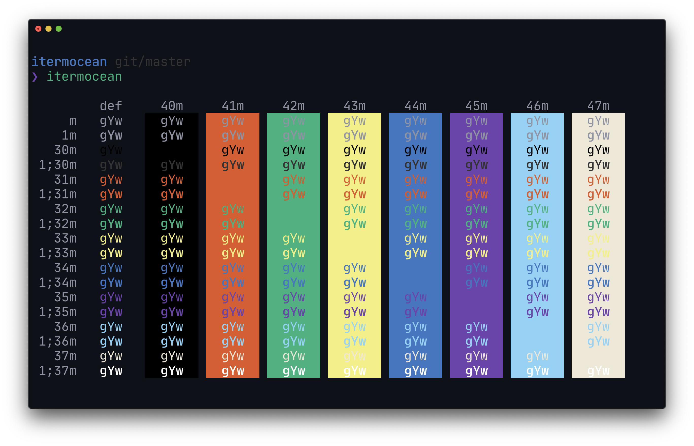

<h1 align="center">
Itermocean
</h1>

<h4 align="center">
  Deep oceanic blue iTerm theme
</h4>

  

## Contents

- [Install](#install)
- [Extra](#extra)
- [Related](#related)
- [Team](#team)
- [License](#license)

## Install

- Right-click [`itermocean.itermcolors`](https://raw.githubusercontent.com/klaussinani/itermocean/master/itermocean.itermcolors) and choose `Save Link As`.
- Double-click the downloaded file.

## Extra

To get the exact same look, install the [JetBrains Mono](https://www.jetbrains.com/lp/mono) font as well as [oh-my-zsh](http://ohmyz.sh/) and set up [pure](https://github.com/sindresorhus/pure) as your zsh prompt.

## Related

- [hyperocean](https://github.com/klaussinani/hyperocean) - Hyper Terminal version
- [ocean-space](https://github.com/oscarmcm/ocean-space) - Visual Studio Code version
- [oceandock](https://github.com/klaussinani/oceandock) - Plank dock version

## Team

- Klaus Sinani ([@klaussinani](https://github.com/klaussinani))

## License

[MIT](license.md)
